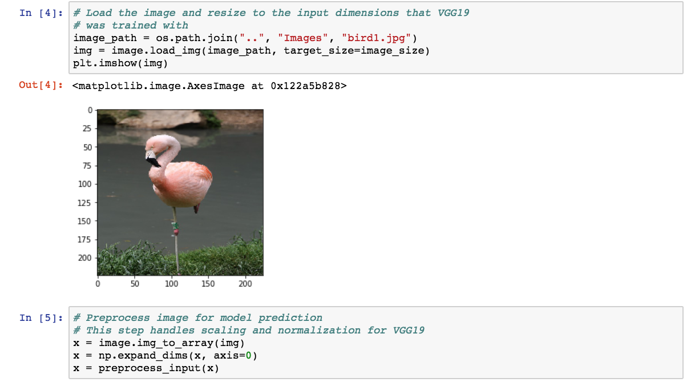
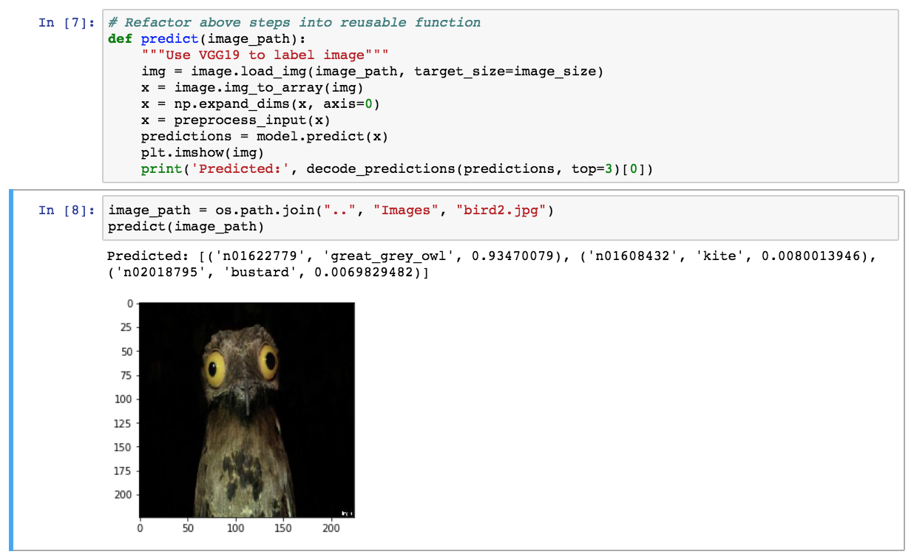
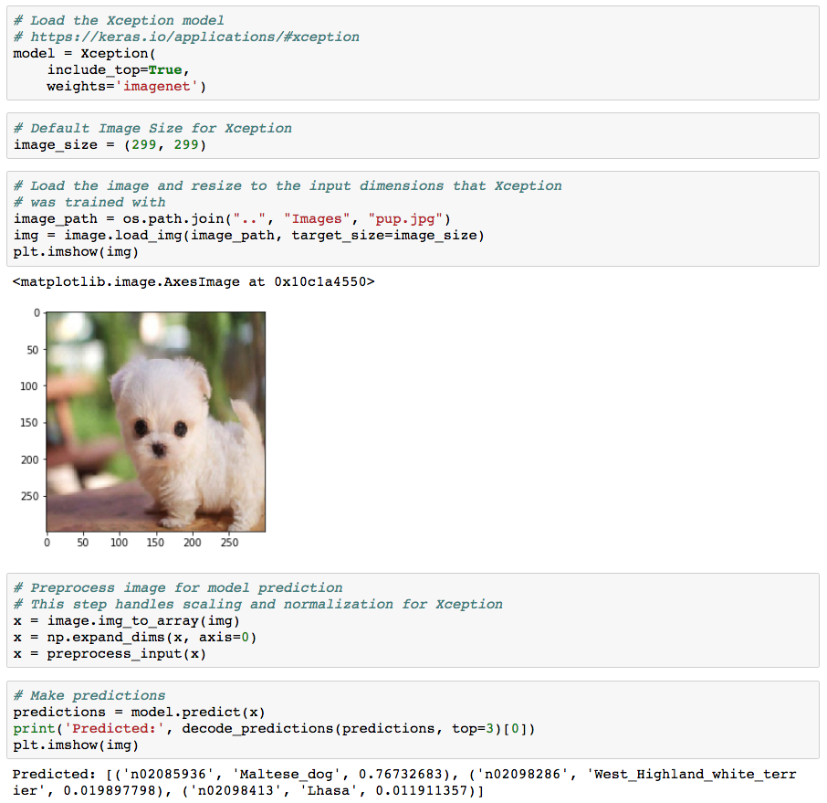
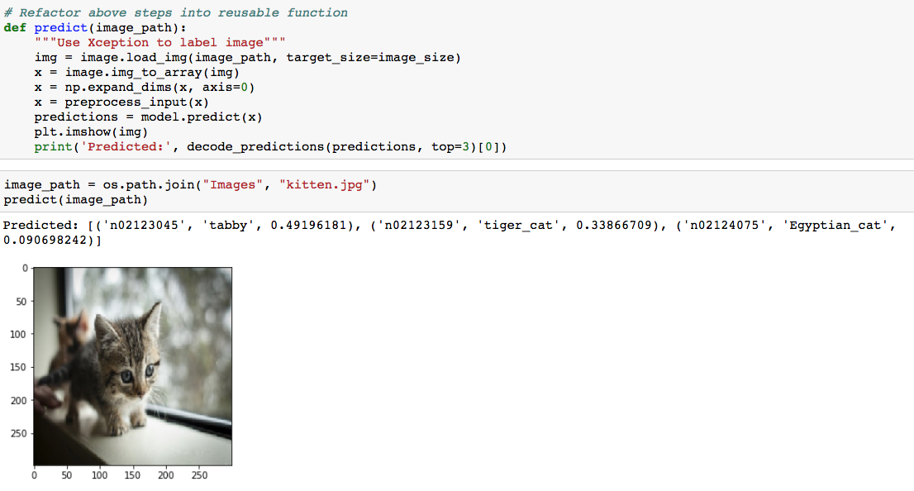

## 23.2 Lesson Plan - Final Projects!

### Please take the End-of-Course Instructional Staff Survey if You Haven't Yet

Trilogy, as a company, values transparency and data-driven change quite highly. As we grow, we know there will be areas that need improvement. It’s hard for us to know what these areas are unless we’re asking questions. Your candid input truly matters to us, as you are key members of the Trilogy team. In addition to the individual feedback at the end of lesson plans
we would appreciate your feedback at the following link if you have not already taken the end-of-course survey:
[https://docs.google.com/forms/d/e/1FAIpQLSdWXdBydy047_Ys1wm6D5iJY_J-0Mo0BqCjfGc4Er2Bz9jo5g/viewform](https://docs.google.com/forms/d/e/1FAIpQLSdWXdBydy047_Ys1wm6D5iJY_J-0Mo0BqCjfGc4Er2Bz9jo5g/viewform)

### Overview

In this class, students will lean how to use pre-trained convolutional neural networks (CNNs) for image classification. The remaining class will be used for project work.

### Instructor Priorities

* Students should have time to work on their projects.

* Make sure your students make measurable progress with their project work.

### Instructor Notes

* While today's class covers a very advanced topic, the material is a lot of fun. Students will learn how to use pre-trained CNNs to classify images.

* Despite the advanced topic, students are only using pre-trained models. Students that are interested in more theory with CNNs can reference the excellent Stanford course: [Convolutional Neural Networks for Visual Recognition](http://cs231n.stanford.edu/).

### Sample Class Video (Highly Recommended)

* To view an example class lecture visit (Note video may not reflect latest lesson plan): [Class Video](https://codingbootcamp.hosted.panopto.com/Panopto/Pages/Viewer.aspx?id=1777447c-e505-4e48-86dd-a89b01834a52)

- - -

### Class Objectives

* Students will be able to import a pre-trained CNN model.

* Students will be able to load an image from file into a data array.

* Students will be able to apply preprocessing to the input data.

* Students will be able to use the pre-trained model to make a prediction.

- - -

### 1. Partners Do: Explore CNN (15 mins)

* For the remainder of class students will use pre-trained CNN models.  The goal of this activity is to gain a high level understanding of CNN and their application.

* **Instructions:** [README.md](Activities/01-Par_Explore_CNNs/README.md)

  * Work with a partner to answer the following questions:

    1. What is a Convolutional Neural Network (CNN)?

    2. What is a CNN typically used for?

    3. What is the difference between a CNN and Deep Neural Network?

### 2. Instructor Do: Review Explore CNN (15 mins)

* The discussion here depends largely on your familiarity with CNN.  Feel free expose students to a more in-depth discussion if you are comfortable.

* Ask for student volunteers for answers to the CNN questions.

  1. What is a Convolutional Neural Network (CNN)?

  2. What is a CNN typically used for?

  3. What is the difference between a CNN and Deep Neural Network?

* This blog post has a nice high-level explanation of CNN: [The Data Science Blog - An Intuitive Explanation of Convolutional Neural Networks](https://ujjwalkarn.me/2016/08/11/intuitive-explanation-convnets/)

- - -

### 3. Instructor Do: Pre-trained Models (15 mins)

* **File**: [PreTrained_Model.ipynb](Activities/02-Ins_PreTrained_Models/Solved/PreTrained_Model.ipynb)

* Walk through the Jupyter Notebook and highlight the following:

  * Explain that training CNN is often a complex and long process. However, once a model has been trained and evaluated, it can be shared and reused.

  * Explain that Keras provides several pre-trained models that are available for use right out of the box. These models are all trained using the ImageNet dataset. Slack out the link to the ImageNet [website](http://www.image-net.org/) as a reference.

  * Explain that there are several models available to choose from, but this example uses the `VGG19` model.

  * Show that Keras provides utility functions to assist with image loading and data pre-processing. In fact, each model provides it's own pre-processing function to resize, scale, and pre-process an input image into the same format that the model was originally trained on. Without this pre-processing function, users would have to do all of that work themselves before using the model.

  * Explain that the image size can be found directly from the [Keras documentation for the model](https://keras.io/applications/#vgg19).

  

  * Load the image and utilize the preprocessing function to scale and normalize the data.

  

  * Use the loaded model to make predictions.  The `decode_predictions` function is used to find the original image labels for the predicted output label.

  

  * Combine the pre-processing and prediction steps into a reusable function.

  * Use the function to make a prediction.

  

### 4. Students Do: Xception (20 mins)

In this activity, students use the pre-trained `Xception` CNN model to predict image labels.

* **File**: [Xception.ipynb](Activities/03-Stu_Xception/Unsolved/Xception.ipynb)

* **Instructions:** [README.md](Activities/03-Stu_Xception/README.md)

  * Visit the [Xception](https://keras.io/applications/#xception) documentation to determine the image_size and other parameters needed to load and use the model.

  * Pre-process the test image using the model's `preprocess_input` function.

  * Use the trained model to predict the output label for the puppy image.

* **Bonus:**

  * Refactor the above steps into a reusable function that accepts an input image and returns a pre-processed image.

  * Test the code by preprocessing the image of a kitten and printing the predicted labels.

### 5. Everyone Do: Review Xception (10 mins)

* Open [03-Stu_Xception/Xception.ipynb](Activities/03-Stu_Xception/Solved/Xception.ipynb).

* Explain that in this activity, the `Xception` pre-trained model from Keras is used.

* Show the [documentation for the model](https://keras.io/applications/#xception) and explain that this model uses an image size of 299x299 pixels.

* Show that the code for using this model is very similar to the previous example. The Keras pre-processing utilities for the Xception model are used without having to significantly change the code.

  

* For the bonus, the above steps are organized in a function and the function is called to predict labels for the image of the kitten.

  

* Ask for any additional questions before moving on.

- - -

### 6. BREAK (15 mins)

- - -

### 7. Students Do: Project Work (1:30)

### Copyright

Trilogy Education Services © 2018. All Rights Reserved.
